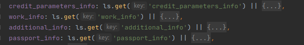

# LocalStorage

## Handler

```
interface ILocalStorageFormHandler {
	set: <T>(key: string, data?: T) => boolean
	get: <T>(key: string) => T
	remove: (key: string) => void
}

export const lsHandler = (): ILocalStorageFormHandler => {
	return {
		set(key, data) {
			if(localStorage.getItem(key)){
				localStorage.removeItem(key)
			}
			localStorage.setItem(key, JSON.stringify(data));
			return true
		},
		get(key: string) {
			const newData = localStorage.getItem(key)
			return newData ? JSON.parse(newData) : undefined
		},
		remove(key: string){
			if(localStorage.getItem(key)) {
				localStorage.removeItem(key)
			}
		}
	}
}
```

## Ключи для анкеты 

```
export const lsKeyStorage = {
	anketa: {
		credit_parameters_info: 'credit_parameters_info',
		work_info: 'work_info',
		additional_info: 'additional_info',
		passport_info: 'passport_info'
	},
	showcase: 'showcase',
}
```

### Используется для задания initialState в reducer

#### Пример



## Данные YandexMetrics

### Данные метрики записываются через Initializer

```
<YMInitializer accounts={[Current.yandexMetrics[currentDomain]]} options={{
     webvisor: true,
     clickmap: true,
     trackLinks: true,
     accurateTrackBounce: true,
     trackHash: true
}}/>
```

#### Нужны только самому Initializer, нами эти данные не используются.