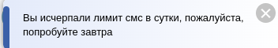

# State-Manager

## ConfigReducer

### Используется для отслеживаний изменений на "низком" уровне.
#### Отвечает за открытие модальных окон, изменение ширины экрана устройства, появление всплывающих уведомлений, появление лоадеров, определения геоданных

> **Модальные окна**

```
modalWindow: {
    actions: {
      sendCreditParameters: false,
      showHypothecModal: false
    },
    view: false,
    href: undefined,
    withSms: false,
    name: undefined,
    surname: undefined,
    phone: undefined,
    callBack: undefined,
},


##### При вызове модальные окна отличаются, для авторизации по автологин ссылке и по обычной.

***Actions***

###### Отвечает за открытие модальных окон
```
export const showModal = (status: boolean, options?: ShowModalOptions): AppThunkType =>
  async (dispatch, getState) => {
return;
    const state = getState().config.modalWindow
    dispatch(configSlice.actions.updateShowModal({
      ...state,
      view: status,
      href: options?.href,
      withSms: options?.withSms || true,
      name: options?.name,
      surname: options?.surname,
      phone: options?.phone,
      callBack: options?.callBack,
    }))
 }
```

> **Лоадеры**

***State***

```
loading: {
    loaderStatus: false,
    message: "Загружаем данные с сервера. Пожалуйста, подождите..."
}
```

***Actions***
```
setSpinner(state, data: PayloadAction<LoaderProps>) {
        state.loading = data.payload
}
```

---

> **Данные пользователя**

***State***

##### Самые важные поля здесь: type, screen_width, sms_code, address #####

```
user: {
    user_agent: window.navigator.userAgent || '',
    screen_width: window.screen.width || null,
    screen_height: window.screen.height || null,
    type: 'BASIC_SMS',
    opener: null,
    vendor: window.navigator.vendor || null,
    vendor_version: window.navigator.vendorSub || null,
    language: window.navigator.language || null,
    do_not_track: window.navigator.doNotTrack || null,
    cookie_enabled: window.navigator.cookieEnabled || null,
    address: null,
    sms_code: null,
}
```

***Actions***

##### Определение геоданных и адреса #####

```
updateUserGeoLocation(state, data: PayloadAction<Address.Full>) {
  state.user.address = data.payload;
},

updateViewPort(state, data) {
  state.viewport = data.payload;
}
```

##### Изменение типа авторизации #####

```
setAuthType(state, {payload}: PayloadAction<'MTS_ID' | 'BASIC_SMS'>) {
  state.user.type = payload
}
```

---

> **Всплывающие уведомления**
> 
##### Пример ####



***State***

```
notification: {
    disableRepeatShow: [],
    notification_list: []
}
```

***Actions***

###### Отвечает за вызов всплывающего уведомления.

```
export const addNotification = (data: Array<string> | string, duration?: number, statusCode?: string): AppThunkType =>
  (dispatch, getState) => {
    const disable = getState().config.notification.disableRepeatShow
    if (statusCode && disable.includes(statusCode)) return
    const list = getState().config.notification.notification_list.slice()
    const count = list.length

    if (typeof data !== 'string' && data.forEach) {
      data.forEach((item) => {
        const errorItem = getState().config.notification.notification_list.filter(errorItem => errorItem.message.toLowerCase() === item.toLowerCase()).length > 0
        !errorItem ?
          list.unshift({
            statusCode: statusCode || null,
            duration: duration || 10,
            id: `${btoa((Math.random() * 10000).toString())}`,
            message: item.toLowerCase() === 'not found' ? 'Произошла ошибка в запросе, пожалуйста повторите действие позже' : item
          })
          : ''
      })
    } else if (typeof data === 'string') {
      if (data.toLowerCase() === 'not found') return
      const errorItem = getState().config.notification.notification_list.filter(errorItem => errorItem.message.toLowerCase() === data.toLowerCase()).length > 0
      !errorItem ?
        list.unshift({
          statusCode: statusCode || null,
          duration: duration || 10,
          id: `${btoa((Math.random() * 10000).toString())}`,
          message: data.toLowerCase() === 'not found' ? 'Произошла ошибка в запросе, пожалуйста повторите действие позже' : data
        })
        : ''
    }

    const second_count = list.length
    if (second_count !== count) {
      dispatch(updateNotificationList(list))
    }
 }
```

###### Отвечает за появление уведомлений, которые не будут повторяться

```
updateDisableNotification(state, data) {
   state.notification.disableRepeatShow = data.payload
}
```